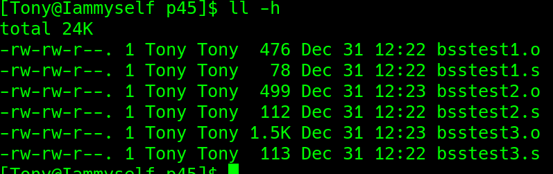
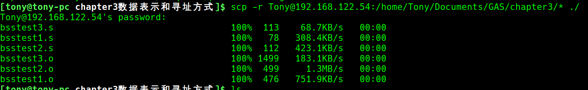

# chapter3数据表示和寻址方式
### 一、常量与变量
bss段不占空间p45



---
这里使用 32 位虚拟机模拟实验
```
scp -r Tony@192.168.122.54:/home/Tony/Documents/GAS/chapter3/* ./
```


---

### 二、数据寻址方式
汇编语言格式：
```
    操作码 操作数
```
> 操作码==>助记符 
>
> 操作数==>寻址方式

想操作数据，就要通过地址查找数据，$\therefore$要获得操作数就必须得到有效地址

#### 1.立即数寻址
以常量的形式在机器码里面，在代码中立即得到
```
movl $10, x
movl %bl, y
movl x, %eax
```

#### 2.寄存器寻址
操作数在寄存器当中，寄存器名表示寄存器存储的数据
##### 1)寄存器间接寻址—— (寄存器)
```
movl (%ebx), %al
movl $100, (%eax)
```
区别
```
movl $100, (%eax)   #将100移到 eax 所指向的**内存单元**
movl $100, %eax     #将100移到 eax **寄存器** 里面

-----------------------------------------------
msg:.ascii "Hello world\n"
len = .-msg

# msg 表示字符串内容 Hello world\n
movl msg, %eax  # 把 msg 的内容给 eax

# $msg 表示字符串的地址
movl $msg, %eax # 把 msg 的地址给 eax

```

##### 2)寄存器相对寻址
```
movl %edx, -4(%edi) #将edx的值 移到 edi指向的**内存单元** 之前的4个字节的内存单元中 
movl %edx, 4(%edi) #将edx的值 移到 edi指向的**内存单元** 之后的4个字节的内存单元中 
```

#### 3.存储器寻址
操作数在主存里面
```
base_address(offset_address, index, size)
# base_address + offset_address + index × size
```
##### 变址寻址
```
array: .int 10, 20, 30, 40, 50, 60, 70, 80, 90
len = (.-array)/4

movl $len, %ecx
movl $0, %edi
```
