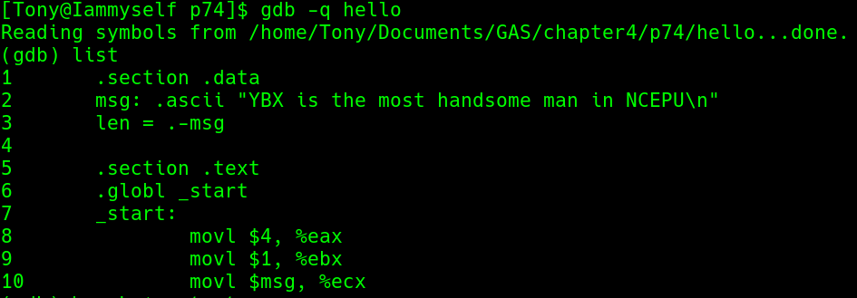
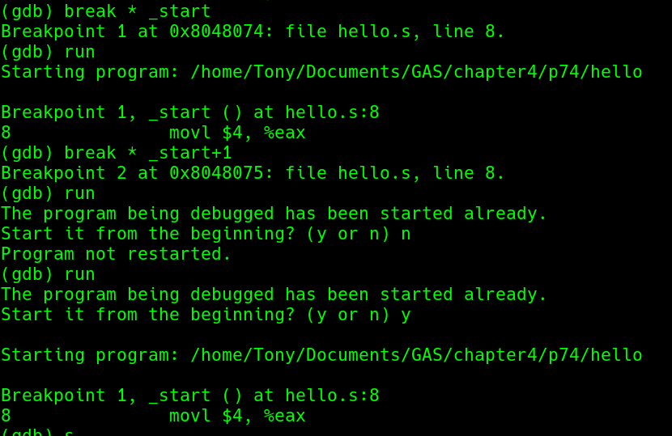
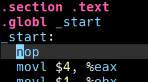
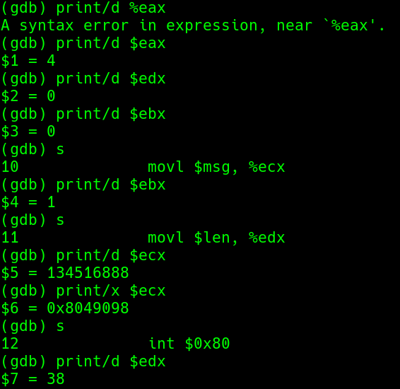
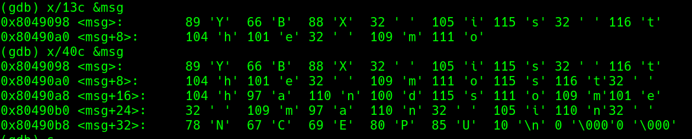

# chapter4Linux系统汇编程序开发工具
如果使用gcc的话必须将
```
.globl _start:  #默认入口是_start
_start:
```
改成
```
.globl main: #gcc默认入口是_start
main:
```


### 演示gdb
#### list

#### break


##### 改进
上面的调试使用
```b * _start```指定断点，程序无法暂停，为了解决这个问题，在```_start```标签下面加上```nop```空指令，使用 ```* _start+1```指定断点


#### print
```
(gdb)print/d $eax   #十进制格式显示eax的值
(gdb)print/x $ecx   #十六进制格式显示ecx的值
```


#### x
```
(gdb)x/40c &msg #查看内存单元的信息
                #字符格式显示msg开始的连续40个单元
```


