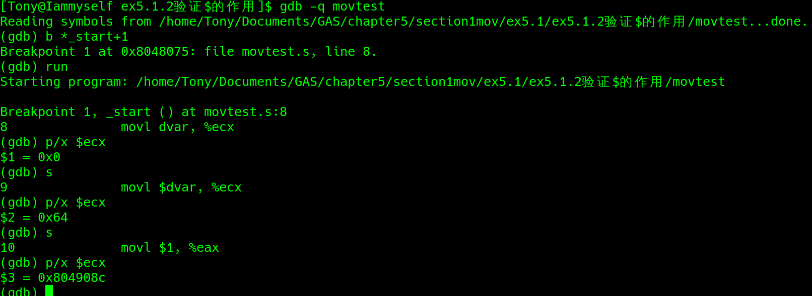

# chapter5数据传送类指令
## 传送类指令——mov
格式
```
movx src, dest
#其中 x 可以是 l(32位), w(16位), b(8位)，就是声明要传送的数据元素长度
eg:
movl %eax, %ebx
movw %ax, %bx
movb %al, %bl
```


```
# msg 表示字符串内容 Hello world\n
movl msg, %eax  # 把 msg 的内容给 eax

# $msg 表示字符串的地址
movl $msg, %eax # 把 msg 的地址给 eax

eg:
    .section .data
    dvar: .int 100

    .section .text
    .globl _start
    _start:
            nop
            movl dvar, %ecx
            movl $dvar, %ecx
            movl $1, %eax
            movl $0, %ebx

```


## 交换指令——XCHG

## 堆栈操作类指令

## 其他传送类指令


