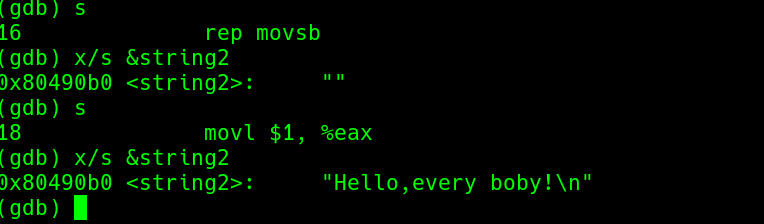

# 串操作指令

> 源 -> esi
> 目的 -> edi

## 一、串传输指令——MOVS
### 1.movsX
<table>
	<tr>
		<td>指令</td>
		<td>名称</td>
		<td>传递</td>
		<td>结果</td>
	</tr>
    <tr>
        <td>movsb</td>
		<td>字节串(1字节)</td>
		<td rowspan="3">ds:(esi)—>es:(edi)</td>
		<td>esi=esi±1<br>edi=edi±1</td>
    </tr>
    <tr>
        <td>movsw</td>
		<td>字串(2字节)</td>
		<td>esi=esi±2<br>edi=edi±2</td>
    </tr>
    <tr>
        <td>movsl</td>
		<td>双字串(4字节)</td>
		<td>esi=esi±4<br>edi=edi±4</td>
    </tr>
</table>

有两种方式加载 esi 和 edi 的值
```
//movl
movl $output, %edi

//lea 指令不需要在output前面加 $ 符号
leal output, %edi
```


如果混用movsb、movsw、movsl的话可能得到的结果存在问题,本来应该是 ```"tring.\n"``` 但得到 ```"ng.\n"```


解决方法就是只是用一种 movsX ，然后循环


### rep
#### movsb
ecx存放带带次数


#### movsw、movsl
rep不光可以跟movsb 结合使用，还可以跟 movsw、movsl 结合，但是不能超出数据穿的边界


#### 综合使用 movsX




## 二、串加载指令——LODS
lods指令不影响标志位

<table>
	<tr>
		<td>指令</td>
		<td>名称</td>
		<td>传递</td>
		<td>结果</td>
	</tr>
    <tr>
        <td>lodsb</td>
		<td>字节串(1字节)</td>
		<td>ds:(esi)—>al</td>
		<td>esi=esi±1</td>
    </tr>
    <tr>
        <td>lodsw</td>
		<td>字串(2字节)</td>
		<td>ds:(esi)—>ax</td>
		<td>esi=esi±2</td>
    </tr>
    <tr>
        <td>lodsl</td>
		<td>双字串(4字节)</td>
		<td>ds:(esi)—>eax</td>
		<td>esi=esi±4</td>
    </tr>
</table>

## 三、串存储指令——STOS
STOP与LODS指令功能互逆，
<table>
	<tr>
		<td>指令</td>
		<td>名称</td>
		<td>传递</td>
		<td>结果</td>
	</tr>
    <tr>
        <td>stosb</td>
		<td>字节串(1字节)</td>
		<td>al—>es:(edi)</td>
		<td>esi=esi±1</td>
    </tr>
    <tr>
        <td>stosw</td>
		<td>字串(2字节)</td>
		<td>ax—>es:(edi)</td>
		<td>esi=esi±2</td>
    </tr>
    <tr>
        <td>stosl</td>
		<td>双字串(4字节)</td>
		<td>eax—>es:(edi)</td>
		<td>esi=esi±4</td>
    </tr>
</table>

串存储指令一般用于初始化某一缓存区很有用，eg；把“A”字符(0x41)复制到1024字节的缓冲区


## 四、串比较指令——CMPS
<table>
	<tr>
		<td>指令</td>
		<td>名称</td>
		<td>传递</td>
		<td>结果</td>
	</tr>
    <tr>
        <td>cmpsb</td>
		<td>字节串(1字节)</td>
		<td rowspan="3">ds:(esi)—es:(edi)</td>
		<td>esi=esi±1<br>edi=edi±1</td>
    </tr>
    <tr>
        <td>cmpsw</td>
		<td>字串(2字节)</td>
		<td>esi=esi±2<br>edi=edi±2</td>
    </tr>
    <tr>
        <td>cmpsl</td>
		<td>双字串(4字节)</td>
		<td>esi=esi±4<br>edi=edi±4</td>
    </tr>
</table>

其实 ```cmps```相当于四条指令
```
movb (%esi), %al
cmpb (%esi), %al
incl %esi
incl %edi
```

这里 ```cmps``` 往往和 ```repe/repz```或```repne/repnz```连用
> 如果 ZF=0 ——> repe (如果两个数组不相等即ZF=1，repe停止)
>
> 如果 ZF=1 ——> repne (如果两个数组相等即ZF=0，repne停止)


## 五、扫描字符串查找——SCAS
就是将al(ax或eax)中的元素与es:(edi)挨个比较
<table>
	<tr>
		<td>指令</td>
		<td>名称</td>
		<td>传递</td>
		<td>结果</td>
	</tr>
    <tr>
        <td>scasb</td>
		<td>字节串(1字节)</td>
		<td>al比较es:(edi)</td>
		<td>esi=esi±1</td>
    </tr>
    <tr>
        <td>scasw</td>
		<td>字串(2字节)</td>
		<td>ax比较es:(edi)</td>
		<td>esi=esi±2</td>
    </tr>
    <tr>
        <td>scasl</td>
		<td>双字串(4字节)</td>
		<td>eax比较es:(edi)</td>
		<td>esi=esi±4</td>
    </tr>
</table>

SCAS继续和 ```repe```与```repne```配合使用
> repe：遍历整个数组，直到找到 不匹配 的字符
> 
> repne：遍历整个数组，直到找到 匹配 的字符