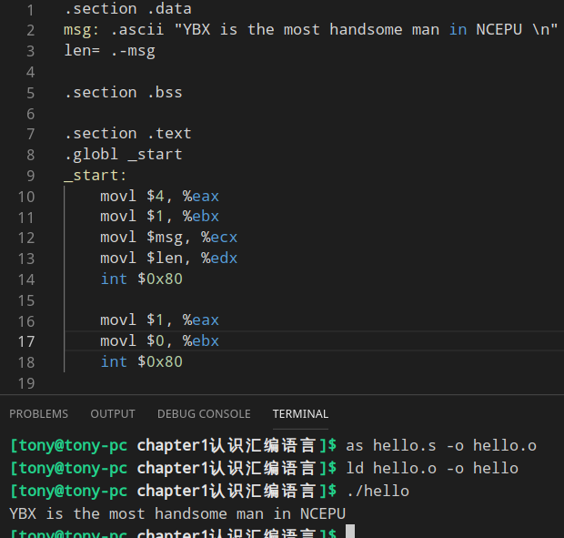

# 基于linux系统的汇编语言程序设计
[cover.jpg](cover.jpg)

### Chapter1 [认识汇编语言](Part1汇编语言程序设计基础/chapter1认识汇编语言/README.md)
```asm
gcc -S hello.c
```

#### 一、指令
伪指令:CPU不产生动作的

硬指令(真指令):CPU产生动作

#### 二、语句格式
```masm
1.执行性语句
硬指令助记符 操作符, 操作符  #注释

2.说明性语句
伪指令助记符 参数, 参数     #注释
eg1:
movl $1, %eax   #将数字1传送到eax中
eg2:
msg: .ascii"YBX is the most handsome man in NCEPU! \n" 
#用ascii定义一个字符串,并使用变量名msg表达其在主存的逻辑地址
# 助记符 ascii 表示在主存中申请空间存放ASCII码,在GAS中数据类型用命令声明,前面有一个 . 
```
#### 三、程序格式
三段式——数据段、bss段、代码段
```
# .section 用于声明段
.section .data

.section .bss
     # 用来声明默认初始化的变量(一遍初始化为0或NULL),这些变量做为缓冲区

.section .text
.globl _start
_start:     #声明开始位置

    movl $1, %eax   #将系统调用号1送到寄存器eax
    movl $0, %ebx   #将返回码0送到寄存器ebx
    int $0x80       #执行1号系统功能调用,返回操作系统,返回码是0
```


## 第二部分 [IA-32处理器的基本指令系统](Part1汇编语言程序设计基础/chapter2IA-32硬件平台/README.md)
80x86基本指令集7个
> 常用符号
> - src：源操作数(source)
> - dest：目的操作数(destination)
> - reg：寄存器(register),一般r8、r16、r32特指8位、16位、32位寄存器
> - mem：内存(memory)
> - imm：立即数(immediatedata)
### 1.数据传送类
> mov xchg push pop clc stc cmc lea
### 2.算数运算类
> add adc inc sub sbb dec neg cmp mul imul div idiv movzx movsz cbw cwd cwde cdq daa das aaa aas aam aad
### 3.位操作类
> and or not xor test shl shr sal sar rol ror rcl rcr
### 4.串操作类
> movs stos lods cmps scas rep repe/repz repne/repnz
### 5.分支程序控制类
> jmp jxx
### 6.循环程序控制类
> loop loope/loopz/loopne/loopnz
### 7.子程序控制类
> call ret