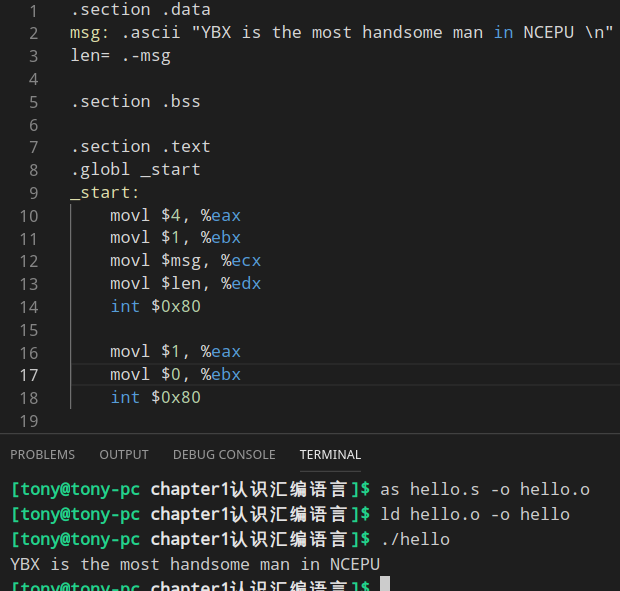

# chapter1 认识汇编语言
#### 一、指令
伪指令:CPU不产生动作的

硬指令(真指令):CPU产生动作

#### 二、语句格式
```masm
1.执行性语句
硬指令助记符 操作符, 操作符  #注释

2.说明性语句
伪指令助记符 参数, 参数     #注释
eg1:
movl $1, %eax   #将数字1传送到eax中
eg2:
msg: .ascii "YBX is the most handsome man in NCEPU! \n" 
#用ascii定义一个字符串,并使用变量名msg表达其在主存的逻辑地址
# 助记符 ascii 表示在主存中申请空间存放ASCII码,在GAS中数据类型用命令声明,前面有一个 . 
```
#### 三、程序格式
三段式——数据段、bss段、代码段
```
# .section 用于声明段
.section .data

.section .bss
     # 用来声明默认初始化的变量(一遍初始化为0或NULL),这些变量做为缓冲区

.section .text
.globl _start
_start:     #声明开始位置

    movl $1, %eax   #将系统调用号1送到寄存器eax
    movl $0, %ebx   #将返回码0送到寄存器ebx
    int $0x80       #执行1号系统功能调用,返回操作系统,返回码是0
```


### 四、汇编器命令
除了**指令**和**数据**，还存在**汇编器命令**，GAS的都由 **.** 开头，其余都是小写

---
#### .section
定义内存段
```
.section .text
.section .data
.section .bss
```
---
#### .globl symbol
，globl可以让连接器ld看到，外部程序可以访问
```
.globl _start
```
---
### 内存申请空间
#### .ascii
```
string1: .ascii "YBX is the most handsome man in NCEPU"
string2: .asciz "YBX is the most handsome man in NCEPU" #结尾多一个0
```
#### .byte
每个表达式占1个**字节**单元
```
varb: .byte 1, 2, 3, 4, 5  #总共占用5个字节
```
#### .word
每个表达式占1个**字**(2个字节)
```
varw: .word 1, 2, 3, 4, 5   #总共占用10个字节
```
#### .long
每个表达式占2个**字**(4个字节)
```
varl: .long 1, 2, 3, 4, 5   #总共占用20个字节
```
#### .quad
每个表达式占4个**字**(8个字节)
```
varq: .quad 1, 2, 3, 4, 5   #总共占用40个字节
```
#### .float
32位单精度浮点数据变量

#### .double
64位单精度浮点数据变量


---
### 预留空间
#### .lcomm symbol, length
为 symbol 预留 length 空间，放在 .bss 中，ld访问不了，只能在本程序中使用(与.globl相反)
```
.lcomm buffer, 100
```
#### .comm symbol, length
为 symbol 预留 length 空间，放在 .bss 中，ld可以访问
```
.comm buffer, 100
```

---
#### .fill
```
.fill repeat, size, value   #反复拷贝 size个字节，重复 repeat 次
# size 和 value 是可选的，默认值分别为 1 和 0.
```
使用
```
.section .data
buffer:
    .fill 10000

#The .fill directive enables the assembler to automatically create the 10,000 data elements for you. 
#The default is to create one byte per field, and fill it with zeros.
#You could have declared a .byte data value, and listed 10,000 bytes yourself.
```
---
### 赋值
#### .set symbol, expression
把 expression 赋值给 symbol
```
等同于
.equ symbol, expression
```

---
### 循环
#### .rept count .endr
循环.rept 与 .endr 之间的 count 次
```
.rept 3
.long 0
.endr

等价于
.long 0
.long 0
.long 0
```
#### .space size, fill
保留 size 个字节，每个字节内容是fill，

size 与 fill 都是常量表达式，fill默认是0
```
.space 1024 #保留1024字节空间，每个字节是0
```
---